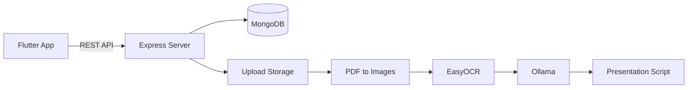

# SpeakFlow Backend

Backend API for **SpeakFlow**, a presentation practice assistant that helps users manage presentations, convert slides from PDF or images, extract slide text with OCR, generate presentation scripts, and store practice results.

> Frontend repository: [presentation-practice-frontend](https://github.com/Ma-meaww/presentation-practice-frontend)

## Features

- Username and password authentication with JWT
- Presentation CRUD operations
- PDF and multiple-image uploads
- PDF page conversion into slide images
- Thai and English OCR with EasyOCR
- AI-assisted Thai presentation script generation
- Standard and formal script styles
- Slide and script management
- Presentation practice result storage
- Swagger API documentation
- Static access to uploaded files

## Tech Stack

| Category | Technology |
| --- | --- |
| Runtime | Node.js |
| API | Express |
| Database | MongoDB, Mongoose |
| Authentication | JSON Web Token, bcryptjs |
| File upload | Multer |
| PDF processing | pdf2pic, pdf-lib |
| OCR | Python, EasyOCR |
| AI script generation | Ollama |
| API documentation | Swagger UI, swagger-jsdoc |

## System Flow



## Project Structure

```text
presentation-practice-backend/
├── controllers/        # Request and response handlers
├── middlewares/        # Authentication, validation, and file uploads
├── models/             # Mongoose models
├── routes/             # API route definitions and Swagger annotations
├── services/           # Business logic, OCR, PDF, and AI services
├── seeds/              # Demo database seed
├── uploads/            # Uploaded PDFs and slide images
├── index.js            # Application entry point
├── databaseconnect.js  # MongoDB connection
├── ocr_easy.py         # EasyOCR runner
├── swagger.js          # Swagger configuration
└── package.json
```

## Prerequisites

Install the following before running the project:

- Node.js and npm
- MongoDB, either locally or through MongoDB Atlas
- Python 3
- EasyOCR
- Ollama, required for full AI script generation

The application can still return a fallback script when Ollama is unavailable.

## Installation

Clone the repository:

```bash
git clone https://github.com/Ma-meaww/presentation-practice-backend.git
cd presentation-practice-backend
```

Install Node.js dependencies:

```bash
npm install
```

Install EasyOCR:

```bash
pip install easyocr
```

## Environment Variables

Create a `.env` file in the project root:

```env
API_PORT=3000

CONNECTION_STRING=mongodb://127.0.0.1:27017/speakflow

JWT_SECRET=replace_with_a_long_random_secret
JWT_EXPIRES_IN=1d

OLLAMA_URL=http://localhost:11434
OLLAMA_MODEL=llama3.2
```

### Environment Reference

| Variable | Required | Description |
| --- | --- | --- |
| `API_PORT` | No | Express server port. Defaults to `3000`. |
| `CONNECTION_STRING` | Yes | MongoDB connection string. |
| `JWT_SECRET` | Yes | Secret used to sign authentication tokens. |
| `JWT_EXPIRES_IN` | No | JWT lifetime. Defaults to `1d`. |
| `OLLAMA_URL` | No | Ollama server URL. Defaults to `http://localhost:11434`. |
| `OLLAMA_MODEL` | No | Ollama model used to generate scripts. Defaults to `llama3.2`. |

Do not commit the `.env` file or expose real secrets publicly.

## OCR Configuration

The current OCR service contains a local Python executable path in:

```text
services/ocr.service.js
```

Update the `pythonExe` value to match the Python installation on your machine.

Example:

```js
const pythonExe = "python"
```

EasyOCR supports Thai and English in this project. The first OCR run may take longer while model files are prepared.

## Ollama Setup

Install and start Ollama, then download the configured model:

```bash
ollama pull llama3.2
ollama serve
```

To use another model, change `OLLAMA_MODEL` in `.env`.

## Seed Demo Data

The seed command clears the existing collections before inserting demo data.

```bash
npm run seed
```

Demo account:

```text
Username: demo
Password: 123456
```

Do not use the demo password in a production environment.

## Running the Server

Start the development server:

```bash
npm run dev
```

The API will be available at:

```text
http://localhost:3000
```

Uploaded files are served from:

```text
http://localhost:3000/uploads
```

## API Documentation

After starting the server, open Swagger UI:

```text
http://localhost:3000/api-docs
```

## Main API Endpoints

### Authentication

| Method | Endpoint | Description |
| --- | --- | --- |
| `POST` | `/auth/login` | Log in and receive a JWT |
| `POST` | `/auth/logout` | Return a logout response |

### Presentations

| Method | Endpoint | Description |
| --- | --- | --- |
| `GET` | `/presentations` | Get presentations belonging to the authenticated user |
| `GET` | `/presentations/:id` | Get a presentation |
| `POST` | `/presentations` | Create a presentation |
| `PUT` | `/presentations/:id` | Update a presentation |
| `DELETE` | `/presentations/:id` | Delete a presentation |

Protected requests use:

```http
Authorization: Bearer YOUR_TOKEN
```

### Slides and Uploads

| Method | Endpoint | Description |
| --- | --- | --- |
| `GET` | `/presentations/:presentationId/slides` | Get presentation slides |
| `POST` | `/presentations/:presentationId/slides/from-pdf` | Upload a PDF and create slides |
| `POST` | `/presentations/:presentationId/slides/upload-images` | Upload slide images |
| `PUT` | `/slides/:id` | Update slide information or cleaned OCR text |
| `DELETE` | `/slides/:id` | Delete a slide |

### OCR and AI

| Method | Endpoint | Description |
| --- | --- | --- |
| `POST` | `/slides/:id/ocr` | Extract Thai and English text from a slide |
| `POST` | `/slides/:id/generate-script` | Generate a presentation script |
| `POST` | `/slides/:id/process` | Run OCR and script generation together |

Script levels:

```json
{
  "level": "standard"
}
```

Supported values are `standard` and `formal`.

### Scripts

| Method | Endpoint | Description |
| --- | --- | --- |
| `GET` | `/slides/:slideId/scripts` | Get scripts for a slide |
| `POST` | `/scripts` | Create a script manually |
| `PUT` | `/scripts/:id` | Update a script |
| `DELETE` | `/scripts/:id` | Delete a script |

### Practice Results

| Method | Endpoint | Description |
| --- | --- | --- |
| `GET` | `/presentations/:presentationId/practice-result` | Get the latest practice result |
| `POST` | `/presentations/:presentationId/practice-result` | Create or update a practice result |
| `PUT` | `/practice-results/:id` | Update a result |
| `DELETE` | `/practice-results/:id` | Delete a result |

## Example Login Request

```bash
curl -X POST http://localhost:3000/auth/login \
  -H "Content-Type: application/json" \
  -d "{\"username\":\"demo\",\"password\":\"123456\"}"
```

Example response:

```json
{
  "message": "Login successful",
  "token": "YOUR_JWT_TOKEN",
  "user": {
    "_id": "USER_ID",
    "username": "demo"
  }
}
```

## Current Development Notes

- Uploaded files are stored on the local filesystem.
- The OCR Python path must be configured for each development machine.
- Ollama runs locally by default.
- Some routes currently have different authentication coverage; review route protection before production deployment.
- Automated tests have not been added yet.

## Related Repository

- [SpeakFlow Flutter Frontend](https://github.com/Ma-meaww/presentation-practice-frontend)

## License

This project was developed for educational and presentation-practice purposes.
